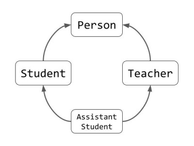

## Условие:

Необходимо реализовать простейшую базу данных, поддерживающую запросы для формирования выборки студентов и преподавателей, подходящих под заданные в запросах условия.

### Иерархия классов:

Все записи в базе данных описываются следующей иерархией классов, которые необходимо реализовать в вашем решении.

**Person** -- базовый класс, хранящий общую информацию для всех людей, связанных с университетом. Про каждого человека
хранится следующая информация:

1. *name* - строковое поле, хранящее имя человека,
2. *birthday* - строковое поле, хранящее дату рождения,
3. *id* - номер СНИЛС-а, уникальное целочисленное значение.

**Student** -- наследник **Person**, в котором добавляются поля специфичные студентам:

1. *department* - строковое поле, хранящее факультет, на котором студент учится,
2. *group* - номер группы,
3. *student_id* - номер зачетной книжки, уникальное поле.

**Teacher** -- наследник **Person**, символизирующий преподавателей. Дополнительные поля:

1. *course* -- курс, который ведет этот преподаватель, текстовое поле,
2. *groups* -- группы, в которых преподаватель ведет свой курс: список целочисленных значений,
3. *students* -- список номеров зачетных книжек студентов, у которых преподаватель является научным руководителем.

Наконец, **AssistantStudent** - наследник и **Student** и **Teacher**, символизирующий студентов старших курсов,
которые уже преподают некоторые дисциплины. У них нет дополнительных полей, но они наследуют их как от студента,
так и от преподавателя.

### Методы классов:

У классов **Student**, **Teacher** и **AssistantStudent** необходимо реализовать метод **\_\_str\_\_**,
возвращающий строку, удобную для быстрого чтения человеком (без лишней информации).

1. Для **Student** s формат строки: `Student {s.name} from group {s.group}, {s.department}`
2. Для **Teacher** t: `Teacher {t.name} on course {t.course}. Works with {len(s.groups)} groups and {len(s.students)} students.`
3. Для **AssistantStudent** as: `Student {as.name} from group {as.group}, {as.department}. Also teaches {as.course} in {len(as.groups)} groups and mentors {len(as.students)} students.`

Кроме того, у каждого класса есть полное представление в текстовом виде, для которого используется формат [JSON](https://en.wikipedia.org/wiki/JSON#Syntax).
Пример:

`{"name" : "Иванов С. В.", "birthday" : "10.01.2003", "id" : 1522347612, "department" : "ММФ", "group" : 22129, "student_id" : 421254}`

Примеры JSON-ов для более сложных полей (например, *groups* у преподавателей), можно найти в тестах.

Вам необходимо: в классах реализовать функции **to_json**, возвращающие JSON строку по объекту, а также функцию для создания
экземпляров соответствующих классов по заданной JSON строке.

Наконец, необходимо реализовать методы **\_\_hash\_\_** и **\_\_eq\_\_** для каждого класса, использующие значения
уникальных полей классов.

### Запросы к базе данных:

База данных представлена, как текстовый файл, каждая строка которого, содержит JSON представление
одного объекта, описанного выше.

Однако, моментально создавать по такой базе данных все объекты в памяти не стоит, вы можете потратить слишком много ресурсов.
Вместо этого, пользователь может написать запрос к вашей базе данных на специальном языке запросов. В ответ он получает
объект-генератор, позволяющий перебрать все, подходящие под запрос объекты в базе (уже выделяя их в памяти).

Запрос имеет вид:

`get records [where {condition}]`  

Опциональный блок `where` описывает ограничения на то, какие записи нужно возвращать.
`{condition}` при этом состоит из ограничений одного из четырех видов:

1. `{field} is set` проверяющее, что поле `{field}` присутствует в записи,
2. `{field} is {value}` проверяющее, что поле `{field}` присутствует в записи и равно `{value}`,
3. `{field} in {collection}`  проверяющее, что поле `{field}` присутствует в записи и содержится в коллекции `{collection}`.
Коллекция при этом задается, как множество элементов, например: `{22126, 22127, 8126}`
4. `{field} contains {value}` проверяющее, что поле `{field}` присутствует в записи, обозначает коллекцию, которая при этом содержит `{value}`.

## Формат входных данных:

Вам необходимо реализовать функцию <code>solution(requests: TextIO, db_name: str, output: TextIO) -> None</code> в файле <code>database.py</code>,
которая принимает на вход два открытых уже файла **requests** (список запросов, по одному на строчку) и **output**, а также имя файла **db_name**,
являющегося базой данных. Обратите внимание, что файл **db_name** пока не открыт, вы должны будете сами открывать его по запросу.

## Формат выходных данных:

В выходной файл **output** нужно записать последовательный вывод всех выполненных запросов. Для этого стоит использовать `__str__` для каждого из полученных объектов. 

## Пример входных и выходных данных:

<table>
    <thead>
        <tr>
            <th>Запрос</th>
            <th>Вывод</th>
            <th>База данных</th>
        </tr>
    </thead>
    <tbody>
        <tr>
            <td><pre>get records where group is 22129</pre></td>
            <td><pre>Student Иванов С. В. from group 22129, ММФ
Student Иванова В. В. from group 22129, ММФ</pre></td>
            <td rowspan=3><pre>{"name" : "Иванов С. В.", "birthday" : "10.01.2003", "id" : 1522347612, "department" : "ММФ", "group" : 22129, "student_id" : 421254}
{"name" : "Петрова И. К.", "birthday" : "15.03.2001", "id" : 8992141190, "department" : "ФФ", "group" : 19301, "student_id" : 235251}
{"name" : "Медведев Т. С.", "birthday" : "31.12.2002", "id" : 124556132, "department" : "ФЕН", "group" : 19402, "student_id" : 715541}
{"name" : "Зуброва Д. А.", "birthday" : "10.04.1991", "id" : 2952146170, "department" : "ММФ", "group" : 8126, "student_id" : 52341}
{"name" : "Власов Г. В.", "birthday" : "23.07.1960", "id" : 4215161, "course" : "Ан.геом", "groups" : [19301, 22129], "students" : [52341, 235251]}
{"name" : "Иванова В. В.", "birthday" : "10.01.2003", "id" : 1522347647, "department" : "ММФ", "group" : 22129, "student_id" : 421255}
{"name" : "Ударников В. П.", "birthday" : "19.05.2000", "id" : 51261221, "department" : "ММФ", "group" : 17121, "student_id" : 124412, "course" : "Программирование-2", "groups" : [22129], "students" : []}
{"name" : "Кузнецова Л. И.", "birthday" : "20.04.1980", "id" : 4215161, "course" : "Программирование", "groups" : [19129, 8126], "students" : [421254, 124412, 715541]}
</pre></td>
        </tr>
        <tr>
            <td><pre>get records where course is set</pre></td>
            <td><pre>Teacher Власов Г. В. on course Ан.геом. Works with 2 groups and 2 students.
Student Ударников В. П. from group 17121, ММФ. Also teaches Программирование-2 in 1 groups and mentors 0 students.
Teacher Кузнецова Л. И. on course Программирование. Works with 2 groups and 3 students.</pre></td>
        </tr>
        <tr>
            <td><pre>get records where department in {"ММФ", "ФФ"}</pre></td>
            <td><pre>Student Иванов С. В. from group 22129, ММФ
Student Петрова И. К. from group 19301, ФФ
Student Зуброва Д. А. from group 8126, ММФ
Student Иванова В. В. from group 22129, ММФ
Student Ударников В. П. from group 17121, ММФ. Also teaches Программирование-2 in 1 groups and mentors 0 students.</pre></td>
        </tr>
    </tbody>
</table>

